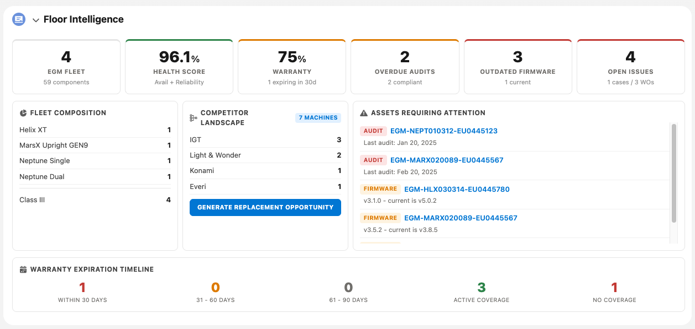

# SFS - Floor Intelligence

<p align="center">
  
</p>

Account-level dashboard LWC for gaming/casino environments. Shows fleet health, competitor landscape, warranty coverage, regulatory compliance, firmware status, and service issues for gaming assets (EGMs). Includes one-click competitor replacement opportunity generation.

## What's Included

| Component | Type | Description |
|-----------|------|-------------|
| `SFS_RN_FloorIntelligenceCtrl` | Apex Class | Controller with fleet analytics, health scoring, and opportunity generation |
| `SFS_RN_FloorIntelligenceCtrlTest` | Apex Test | 6 test methods, 90%+ coverage |
| `sfsRnFloorIntelligence` | LWC | Main dashboard component (Account record page) |
| `sfsRnDeleteOpportunity` | LWC | Quick action to delete replacement opportunities |
| `Opportunity.SFS_RN_Delete_Opportunity` | Quick Action | Wired to the delete LWC |
| 8 Custom Fields on Asset | CustomField | Cabinet_Model__c, Asset_Class__c, Firmware/Software_Version__c, Availability/Reliability, Asset_Level__c, Location_on_Floor__c |

## Dashboard Sections

- **Fleet Composition** - Total EGMs, components, model/class breakdown
- **Fleet Health Score** - Weighted score from availability (40%), reliability (40%), uptime (20%)
- **Warranty Coverage** - Covered vs uncovered, 30/60/90-day expiration warnings
- **Regulatory Compliance** - Overdue audit flags based on AssetAttribute records
- **Firmware & Software** - Outdated version detection against known-current versions
- **Competitor Landscape** - Competitor brand breakdown with one-click replacement opportunity
- **Service Issues** - Open Cases and Work Orders by priority

## Prerequisites

- Salesforce org with **Asset Management** enabled
- **Field Service** license (for WorkOrder queries)
- **Warranty Management** enabled (for AssetWarranty)
- **Asset Attributes** enabled (for regulatory audit tracking)
- Products in the standard Pricebook with codes: `EGM-NEPT-S`, `EGM-MARX-U9`, `EGM-HLX-XT`, `EGM-NEPT-D` (for replacement opportunity line items)
- An `AttributeDefinition` with DeveloperName `Last_Regulatory_Audit` (DataType: Date)

## Deployment

### Option 1: Terminal / GitHub (Recommended)

```bash
# Clone the repo
git clone https://github.com/your-username/sfs-rn-floor-intelligence.git
cd sfs-rn-floor-intelligence

# Authenticate to your target org
sf org login web --set-default --alias my-demo-org

# Deploy all metadata
sf project deploy start --source-dir force-app --target-org my-demo-org

# Verify deployment
sf project deploy report --target-org my-demo-org
```

### Option 2: VS Code

1. Clone or download this repo
2. Open the folder in VS Code (with Salesforce Extension Pack installed)
3. Run **SFDX: Authorize an Org** from the Command Palette (`Cmd+Shift+P`)
4. Right-click the `force-app` folder in the Explorer and select **SFDX: Deploy Source to Org**
5. Check the Output panel for deployment status

### Option 3: Deploy from Manifest

```bash
sf project deploy start --manifest manifest/package.xml --target-org my-demo-org
```

## Post-Deployment Setup

### 1. Add the LWC to the Account Record Page

1. Navigate to any Account record
2. Click the gear icon and select **Edit Page**
3. Drag **SFS RN Floor Intelligence** from the Components panel onto the page
4. Save and activate the page

### 2. Add the Delete Quick Action to Opportunity Page Layout

1. Go to **Setup > Object Manager > Opportunity > Page Layouts**
2. Edit the relevant layout
3. Drag **SFS RN Delete Opportunity** from the Quick Actions section to the layout
4. Save

### 3. Create the Attribute Definition (if not present)

1. Go to **Setup > Asset Attributes > Attribute Definitions**
2. Click **New**
3. Set DeveloperName to `Last_Regulatory_Audit`, DataType to `Date`
4. Save

### 4. Seed Demo Data

Edit `scripts/seed-demo-data.apex` and set the `accountName` variable to your target Account name, then run:

```bash
sf apex run -f scripts/seed-demo-data.apex -o my-demo-org
```

This creates 4 owned EGMs with health metrics, 12 child components, 7 competitor machines across 4 brands, regulatory audit attributes, and warranty records.

## Customization

### Firmware Versions

Update the `CURRENT_FIRMWARE` map in `SFS_RN_FloorIntelligenceCtrl.cls` to match your demo cabinet models and firmware versions.

### Competitor-to-Product Mapping

Update the `BRAND_TO_PRODUCT` map to change which Aristocrat products are recommended as replacements for each competitor brand.

### Cabinet Models

Add or remove picklist values in `Asset.Cabinet_Model__c` to match your demo scenario.

## File Structure

```
sfs-rn-floor-intelligence/
  force-app/main/default/
    classes/
      SFS_RN_FloorIntelligenceCtrl.cls
      SFS_RN_FloorIntelligenceCtrl.cls-meta.xml
      SFS_RN_FloorIntelligenceCtrlTest.cls
      SFS_RN_FloorIntelligenceCtrlTest.cls-meta.xml
    lwc/
      sfsRnFloorIntelligence/
        sfsRnFloorIntelligence.js
        sfsRnFloorIntelligence.html
        sfsRnFloorIntelligence.css
        sfsRnFloorIntelligence.js-meta.xml
      sfsRnDeleteOpportunity/
        sfsRnDeleteOpportunity.js
        sfsRnDeleteOpportunity.html
        sfsRnDeleteOpportunity.js-meta.xml
    objects/Asset/fields/
      Cabinet_Model__c.field-meta.xml
      Asset_Class__c.field-meta.xml
      Firmware_Version__c.field-meta.xml
      Software_Version__c.field-meta.xml
      Asset_Availability__c.field-meta.xml
      Asset_Reliability__c.field-meta.xml
      Asset_Level__c.field-meta.xml
      Location_on_Floor__c.field-meta.xml
    quickActions/
      Opportunity.SFS_RN_Delete_Opportunity.quickAction-meta.xml
  manifest/
    package.xml
  scripts/
    seed-demo-data.apex
```
